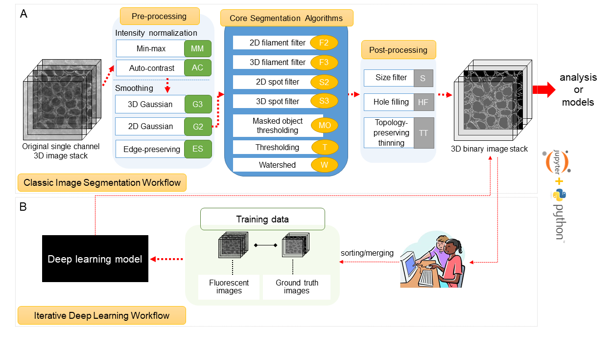

# LatchBio Hackathon

## Project Scope

This is a LatchBio workflow that is an implementation of the [Allen Cell & Structure Segmenter](https://www.allencell.org/segmenter.html) toolkit. The purpose of this library is to provide 3D segmentation of intracellular structures in fluorescence microscopy images.

Visual representation of the toolkit's capabilities

While it is possible to provide the pre-processing, core segmentation algorithm and post-processing primitives directly to the user, it is not conducive to a smooth user workflow due to the large amount of experimental trial and error required.

Based on the current state of the art, a variety of [classic image segmentation workflows](https://www.allencell.org/segmenter.html#lookup-table) have been provided, for the user to select the one most similar to the input data's characteristics as a starting point.

**Note:** The underlying library supports both a classic image segmentation and an iterative deep learning workflow. In the current implementation, only the classic segmentation is supported.

## Usage

This is documented in additional detail inline within the LatchBio workflow. Briefly, there are a few components:

- Image upload - accepts any well-formatted TIFF file
- Selection of segmentation workflow - please see [this page](https://www.allencell.org/segmenter.html#lookup-table) for larger images and supplementary videos
- Additional options to tweak the segmentation parameters

The output will be your segmented image.

## Comparison versus existing methods

The current method of segmentation offered by the Allen toolkit involves using a jupyter interactive notebook to tweak parameters and load data for processing. Here is [an example](https://github.com/AllenCell/aics-segmentation/blob/main/lookup_table_demo/demo_TNNI1.ipynb) of one such notebook.

Batch processing is achieved by using a wrapper script once parameters have been determined. There is also a Python-based GUI with a plugin. While these methods suffice, they require a local installation of the exact python environment and dependencies and work only on Windows and Linux.

The LatchBio workflow, in contrast, is web-based, and simple for users to modify to their requirements. Batch-based processing is built into the platform, and environment issues are directly avoided.

## Validation

The output of this workflow has been compared with the sample test data provided by the repository authors [here](https://github.com/AllenCell/aics-segmentation/tree/main/aicssegmentation/tests/resources/images)

Run parameters:
 - Input file: `random_input.tiff`
 - Segmentation Type: `Nucleophosmin (npm1)`

Test output from Allen [here](https://github.com/AllenCell/aics-segmentation/blob/main/aicssegmentation/tests/resources/images/expected_npm1_struct_segmentation.tiff)
(Identical) output from workflow [here](docs/processed_npm1_struct_segmentation.tiff)

## Demo

_TODO: insert GIF here_

## References

- [Original research paper](https://www.biorxiv.org/content/10.1101/491035v2)
- [Segmenter Documentation](https://www.allencell.org/segmenter.html)
- [pipeline-qc](https://github.com/aics-int/pipeline_qc/blob/master/pipeline_qc/segmentation/structure/structure_seg_service.py)

## Further work

- Support deep learning workflow
- Expose additional segmentation parameters via LatchBio workflow
- Integrate with Pods, for interactive parameter selection and feedback?

